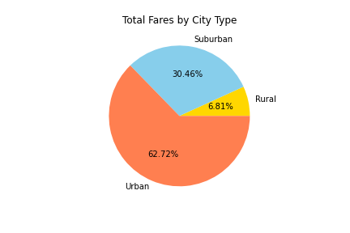

# ride-share-analysis

## Purpose

The purpose of this analysis is to evaluate the difference in ride share data in order to make determinations about strategy for improving business income.

## Results

A quick glance at the summary of fare information compared against city types tells some very important information.

### Total Ridership

There are 13 times as many urban rides as there are rural rides (1625 vs 125) and 5 times as many suburban rides as rural rides (625 vs 125).  As a result, the data indicate that urban rides account for more than 50% of total ridership for PyBer.

### Total Revenue

Urban rides account for 62.72% of total revenue with $39,854.38 of the $63,538.64 in total revenue.  Suburban rides make up 30.46% of the total revenue and rural rides account for 6.81%.

### Average Fare per Ride

Despite accounting for more than 60% of the total fare revenue, the average fare per ride in urban cities is the lowest. at $24.53 per ride, it is over $6 less than suburban cities at $30.97 per ride and over $10 less than rural cities at $34.62 per ride.

### Total Drivers and Average Fare per Driver

The total driver count for rural cities are is the lowest at 78, resulting in an average fare per driver of $55.49.  The total driver count for suburban cities is 490, resulting in an average fare per driver of $39.50.  The total driver count for urban cities is 2405, resutling in an average fare per driver of $16.57.

## Summary

### Assessment

