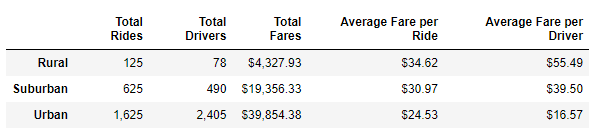

# ride-share-analysis

## Overview

### Purpose

The purpose of this analysis is to evaluate the difference in ride share data in order to make determinations about strategy for improving business income.

## Results

A quick glance at the summary of fare information compared against city types tells some very important information.

### Total Ridership

There are 13 times as many urban rides as there are rural rides (1,625 vs 125) and 5 times as many suburban rides as rural rides (625 vs 125).  As a result, the data indicate that urban rides account for 68.4% of total ridership for PyBer, while suburban rides account for 26.3% and rural rides account for 5.3%.

### Total Revenue

Urban rides account for 62.72% of total revenue with $39,854.38 of the $63,538.64 in total revenue.  Suburban rides make up 30.46% of the total revenue with $19,356.33 and rural rides account for 6.81% of the total revenue with $4,327.93.

Furthermore, these revenue totals do not appear to be the result of any anormal spikes as the weekly total fares assessed from 2019-01-01 to 2019-04-28 indicate fairly steady behavior.

### Average Fare per Ride

Despite accounting for more than 60% of the total fare revenue, the average fare per ride in urban cities is the lowest. at $24.53 per ride, it is over $6 less than suburban cities at $30.97 per ride and over $10 less than rural cities at $34.62 per ride.

### Total Drivers and Average Fare per Driver

These data were aggregated together to highlight their inverse relationship. Where a lower driver count would intuitively suggest that each driver is receiving a higher average fare, the data support this.  The total driver count for rural cities are is the lowest at 78, resulting in an average fare per driver of $55.49.  The total driver count for suburban cities is 490, resulting in an average fare per driver of $39.50.  The total driver count for urban cities is 2405, resutling in an average fare per driver of $16.57.

## Summary

### Assessment

The data provided show trends that are consistent with intuitive expectations.  Urban cities have a higher total ride count and a higher total driver count, both of which are likely due to the higher population density.  The average fare per ride in urban areas is lower, likely due to rides covering shorter distances and taking less time.  Rural areas show the opposite, likely because rides cover longer distances.  Even the less than ideal state of having a decreased average fare per driver is intuitive as a result of having more drivers than rides, albeit unfortunate.

Based on the data, the following are recommendations for the business that area aimed at increasing ridership as well as increasing the ability for the company to service that increased ridership.

### Recommendation 1

Across all city types, run a promotional period of discounted rates.  To the extent which it is reasonable, this should come out of PyBer's profit from the fares and not reduce the income of the drivers so that they may be retained.  The goal of this is to increase ridership over a period of time that results in retention of customers after they have built familiarity with the service.

### Recommendation 2

Incentivize or otherwise encourage some number of urban drivers to move their service area out to suburban and rural areas as appropriate.  An excess of drivers compared to rides in any area is beneficial only in the short term, in that it greatly increases the chance that a potential customer will havea an available driver nearby when a ride is needed.  However, the long term effect of having more drivers than customers in an area is that the drivers will eventually leave due to a lack of income.

Rebalancing available drivers to potentially underserved service areas will not only offer availability of the service to more customers, but it will also take advantage of the higher average fare per ride of those areas.

### Recommendation 3

Offer new-driver bonuses in suburban and rural areas in order to increase the driver presence in those areas.  Like recommendation 2, this is aimed at allowing the company to take advantage of the higher average fare per ride by increasing the availability of service in suburban and rural areas.